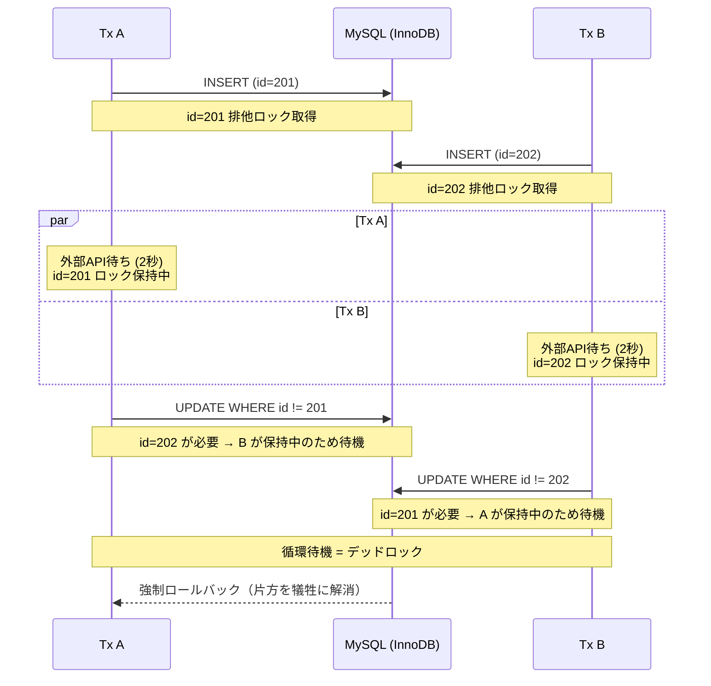

# 【図解】INSERT → 外部API → 論理削除：Tx内の外部API呼び出しがlock waitを爆増させる

## 障害発生

ある日、本番システム（MySQL 8.0 / InnoDB）で以下のエラーが多発していることがわかりました。

- `Error: 1205 (HY000): Lock wait timeout exceeded; try restarting transaction`（ロックの順番待ちでタイムアウト）
- `Error: 1213 (40001): Deadlock found when trying to get lock; try restarting transaction`（ロックの循環待機で処理が強制終了される現象）

調べていくと、**トランザクション内で外部APIを呼んでいる**処理が原因でした。

※ 以下、トランザクションを「Tx」と略します。

---

## 1. 何が起きていたのか

該当の処理はこういうコードでした。

```sql
BEGIN;
  INSERT INTO configs (...) VALUES (...);   -- ① 新しい設定を登録
  外部API呼び出し（決済・通知など）             -- ② 数百ms〜数秒待機
  UPDATE configs SET is_deleted = 1          -- ③ 自分以外を論理削除
    WHERE tenant_id = ? AND id != ? AND is_deleted = 0;
COMMIT;
```

「最新の設定だけ残して、古いのを論理削除する」というよくある処理。これが並行で走るとデッドロックが起きます。

### デッドロックの発生シーケンス



お互いが相手のロックを待ち続ける循環待機が発生。MySQLはこれをデッドロックとして検知し、片方のTxを強制ロールバックして解消します。

### なぜ循環が生まれるのか

InnoDBは `UPDATE WHERE id != ?` のような範囲条件に対して、**条件に合う行だけでなく広い範囲にロックをかけに行きます**。だから相手がINSERTした行も巻き込んで循環待機が起きます。

### 外部APIが「デッドロック増幅装置」になる

本来、データベースの更新は数ミリ秒で終わるため、ロック競合の隙はほぼありません。しかし、間に外部APIが挟まることでロック保持時間が数百倍に伸びます。

**「ちょっと鍵貸して」の状態が、API待ちのせいで「1時間立てこもり」に変わるようなもの。** 当然、衝突確率は跳ね上がります。

| 処理 | 所要時間 |
|------|---------|
| 1行のINSERT | 0.1〜1ms |
| 100行のUPDATE | 1〜10ms |
| 外部API呼び出し | **100〜3,000ms** |

外部APIはDB操作の**100〜10,000倍遅い**。この2つを同じTxに入れると、ロック保持時間がAPIのペースに引きずられます。

---

## 2. 改善パターンの実測比較

Docker Compose環境（MySQL 8.4、非同期レプリケーション）で、4パターンを同じ条件（50,000行、API 2秒、2Tx同時実行）で実測しました。

### 各パターンの処理フロー

- **Before**: `BEGIN → INSERT → API(2秒) → DELETE → COMMIT`
- **A: API外出し**: `BEGIN → INSERT → COMMIT` → API(2秒) → `BEGIN → DELETE → COMMIT`
- **B: API先出し**: API(2秒) → `BEGIN → INSERT → DELETE → COMMIT`
- **C: 先にロック確保**: `BEGIN → SELECT FOR UPDATE → INSERT → API(2秒) → DELETE → COMMIT`

どのパターンもAPI 2秒は含まれるので、処理全体の時間は2秒以上になります。違いが出るのは**ロックを保持している時間**です。

### 結果

※ **Stale Read** = Writerにコミット済のデータが、Readerレプリカからまだ読めない現象。ロック保持が長いとCOMMITが堰き止められ、一斉解放時にレプリカへの反映が追いつかなくなる（[次回の記事](./article2.md)で詳しく扱います）。

| パターン | デッドロック | ロック保持時間 | Stale Read |
|----------|:---:|:---:|:---:|
| **Before** | 1回 | **約2,600ms**（API待ち中ずっと） | 4回 |
| **A: API外出し** | **0** | **数ms × 2回** | **0** |
| **B: API先出し** | 1回 | **数十〜数百ms** | 4回 |
| **C: 先にロック確保** | **0** | **約3,600ms**（API待ち＋lock wait） | **0** |

※ ロック保持時間 = BEGIN〜COMMITの実測値。パターンAは2つの独立したTxそれぞれの時間。50,000行・API 2秒・2Tx同時実行の条件で、桁の差に注目してください。

重要なのは**APIをロック保持区間の外に出す**こと。AとB+C（API先出し＋SFU）はどちらもこれを満たしています。

### パターンBとC — 直感に反する結果

**パターンB**はAPIを先に済ませてからTxに入るので、一見安全に見えます。しかしTx内でINSERT → DELETEする構造が同じなので、**ロック順序が変わらず、デッドロックは消えません**。

**パターンC**はデッドロックが消えます。SELECT FOR UPDATEでロック順序を固定するので、循環待機は起きません。しかし**ロック保持時間が全パターン中最長の約3.6秒**。なぜか？

```
Tx1: SELECT FOR UPDATE → INSERT → API(2秒) → DELETE → COMMIT  ← 全部で約2.6秒
Tx2: SELECT FOR UPDATE で待ち(約2.6秒) → INSERT → API(2秒) → DELETE → COMMIT
                         ↑ Tx1が終わるまで丸ごとブロック
```

**「デッドロックを直す ≠ 問題を直す」。** アラートは消えますが、lock waitの行列は残ります。

ただし**B+C（API先出し＋SFU）は別物**です。APIがTxの外に出た状態でSFUによるロック順序の固定が効くため、デッドロックもlock waitの長期化も防げます。

---

## 3. 改善後のコード

「APIをロック保持区間の外に出す」を満たす実装は2つあります。

### パターンA — Tx分割（ロック最短）

```go
// Tx1: INSERT だけ COMMIT（ロック保持: 数ms）
tx1, _ := db.BeginTx(ctx, nil)
result, _ := tx1.ExecContext(ctx,
    "INSERT INTO configs (tenant_id, config_value, status) VALUES (?, ?, 'pending')",
    tenantID, value)
newID, _ := result.LastInsertId()
tx1.Commit()  // ← ここでロックを解放

// API呼び出し（データベースのロックは持っていない）
resp, err := callExternalAPI()

// Tx2: 結果を反映（ロック保持: 数ms）
tx2, _ := db.BeginTx(ctx, nil)
if err != nil {
    tx2.ExecContext(ctx, "UPDATE configs SET status = 'failed' WHERE id = ?", newID)
} else {
    tx2.ExecContext(ctx,
        "UPDATE configs SET status = 'completed', external_id = ? WHERE id = ?",
        resp.ID, newID)
    tx2.ExecContext(ctx,
        `UPDATE configs SET is_deleted = 1, deleted_at = NOW(6)
         WHERE tenant_id = ? AND id != ? AND is_deleted = 0`,
        tenantID, newID)
}
tx2.Commit()
```

ロック保持が最短。ただしTx1〜Tx2間に中間状態（`pending`行）が見えるため、読み取り側のフィルタやクラッシュ時の定期回収ジョブが必要です。

### パターンB+C — API先出し＋SFU（アトミック維持）

```go
// API呼び出し（データベースのロックは持っていない）
resp, err := callExternalAPI()
if err != nil { return err }

// 1つのTxでINSERT + DELETE（ロック保持: 数十〜数百ms）
tx, _ := db.BeginTx(ctx, nil)
rows, _ := tx.QueryContext(ctx,
    "SELECT id FROM configs WHERE tenant_id = ? AND is_deleted = 0 FOR UPDATE",
    tenantID)
rows.Close()

result, _ := tx.ExecContext(ctx,
    "INSERT INTO configs (tenant_id, config_value, external_id) VALUES (?, ?, ?)",
    tenantID, value, resp.ID)
newID, _ := result.LastInsertId()

tx.ExecContext(ctx,
    `UPDATE configs SET is_deleted = 1, deleted_at = NOW(6)
     WHERE tenant_id = ? AND id != ? AND is_deleted = 0`,
    tenantID, newID)
tx.Commit()
```

INSERT + DELETEが1Txでアトミック。中間状態が見えず、pending管理も不要。実務ではこのパターンで対応しました。

### どちらを選ぶか

| | A: Tx分割 | B+C: API先出し＋SFU |
|---|:---:|:---:|
| ロック保持 | 数ms × 2回（最短） | 数十〜数百ms |
| アトミック性 | Tx間に中間状態あり | 1Txで完結 |
| 追加の仕組み | pending管理・定期回収ジョブ | 不要 |

どちらもAPIをロック区間の外に出す原則は同じです。Txを分割する場合はビジネス側の要件と擦り合わせた改修が必要だと思われます。

---

## 振り返り

| 調査の段階 | わかったこと |
|-----------|-------------|
| デッドロック調査 | INSERT → API → DELETE の順序でロック競合 |
| 改善パターン実測 | APIをTx外に出すとデッドロック解消、ロック保持時間が激減 |
| パターンCの罠 | デッドロックを消してもlock waitが残れば問題は解決しない |
| パターンB+C | API先出し＋SFUでデッドロックもlock waitも防げる |

---

### 3行まとめ

1. トランザクション内の外部APIは、ロック保持時間を数千倍にし「lock wait」を爆増させる
2. デッドロック回避（SELECT FOR UPDATE等）だけでは不十分。APIがTx内にある限りlock waitは残る
3. 解決策は「APIをTxの外に出す」。Tx分割（A）でもAPI先出し＋SFU（B+C）でもよい

---

## 次の記事

ところで、上の表で「Stale Read 4回 vs 0」と並んでいるのは何だったのか。本番ではこれが**数十分〜数時間**続いていました。なぜ数十件の更新が、それほど長いレプリカ遅延に化けるのか——次回はその仕組みを、ダム決壊モデルとして検証します。

→ [記事2: 数十件の更新が、なぜ数時間のレプリカ遅延に化けるのか — ダム決壊モデル](./article2.md)

---

## 再現環境

この記事の検証コードはリポジトリで公開しています。`make demo` 一発で再現できます。

```bash
git clone https://github.com/TaichiFujii0326/deadlock-replication-demo.git
cd deadlock-replication-demo
make demo
```

---

**タグ**: MySQL 8.0, InnoDB, Deadlock, Lock Wait, Lock wait timeout exceeded, Error 1205, Error 1213, performance-tuning, Transaction, 外部API
