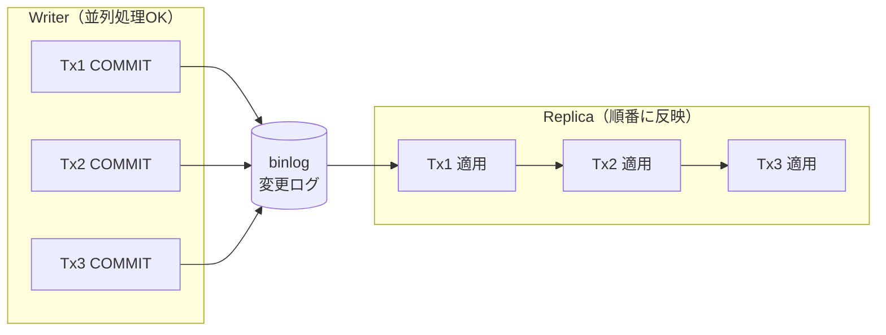
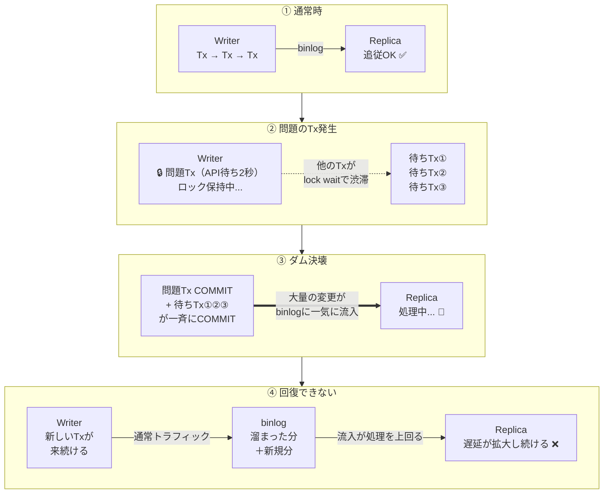

# DB障害を追う——レプリカ遅延の犯人は、ダム決壊。事件解決——のはずだった

## 「コミット済みなのに、Replicaから読めない」

[前回の記事](./article1.md)で、Tx内の外部API呼び出しがlock waitとデッドロックを爆増させる構造と、その改善パターンを実測しました。表の右端に「Stale Read」という列があったのを覚えているでしょうか。

| パターン | デッドロック | ロック保持時間 | Stale Read |
|---|:---:|:---:|:---:|
| **Before** | 1回 | 約2.6秒 | **4回** |
| **A: API外出し** | 0 | 数ms × 2回 | **0** |

Stale Read = Writerにコミット済みのデータが、Readerレプリカからまだ読めない現象。本番ではこれが**数十分〜数時間**続いていました。

更新対象はたかだか数十件。デッドロックも一瞬で解消される。なのに、なぜそれほど長くデータが読めない状態が続いたのか？

この記事では、その疑問を再現環境で検証していきます。

※ 以下、トランザクションを「Tx」と略します。

---

## 1. レプリケーションの仕組み

検証の前に、Writer/Replica構成でデータがどう同期されるか、基本を押さえておきます。



※ **binlog（バイナリログ）** = Writerで「どの行をどう変更したか」を時系列で記録するログファイル。Replicaはこれを受信して自分のデータベースに反映します。

ここに構造的なボトルネックがあります。Writerは並列で高速に処理できるのに、Replicaは受信した変更を**1つずつ順番に**反映する。この**並列度のギャップ**が、後で効いてきます。

---

## 2. 検証① — 問題のTx単体ではどれだけ遅延するか

まずは前回の検証①と同じ条件で、ベースラインを確認します。

Docker Compose環境（MySQL 8.4、非同期レプリケーション）で、問題のTx（INSERT → API 2秒 → DELETE）を2つ同時実行。初期データ50,000行。

```
T+0ms      2つのTxを同時実行（50,000行のactiveデータあり）
T+2645ms   デッドロック発生 → Tx1がロールバック、Tx2がコミット（50,000行削除）
T+2745ms   Replicaで読めない
  ...       (100ms間隔でポーリング)
T+3246ms   ようやく読めた    読めなかった時間: 501ms
```

問題のTx単体では**500msのStale Read**。

500ms。本番の数十分〜数時間とは桁が違います。**ここに通常の業務トラフィック（バッチ登録など）が重なると何が起きるか。**

---

## 3. 検証② — バッチ登録を流しながら実行する

本番では2つの処理が同時に走っていました。

- **バッチ登録処理**: Writerに連続書き込み、直後にReplicaから読み取り。**読み取りエラーが起きていたのはこの処理**
- **問題のジョブ**: INSERT → 外部API → 論理DELETE。デッドロックとlock waitを引き起こす

バッチ処理はWriterへの書き込みでレプリカ遅延の**悪化に加担**し、同時にReplicaからの読み取りで遅延の**被害を受けている**。この2つが重なったタイミングで現象が深刻化しました。

そこでバッチ登録と同時に実行する検証を行いました。

- **初期データ**: 100行（本番に近い規模）
- **バックグラウンド**: 10 workerがWriterへの書き込みを継続（バッチ登録処理を模擬）
- **途中で注入**: 問題のTx（INSERT → API 2秒 → DELETE）を3回実行

### 結果

```
[ウォームアップ]  バッチ登録だけ → lag = 17ms（余裕で追従）

[問題のTx注入 × 3回]
  1回目: デッドロック発生、100行削除  → lag = 588ms
  2回目: デッドロック発生、1行削除    → lag = 778ms
  3回目: デッドロック発生、1行削除    → lag = 870ms

[注入終了後 — バッチ登録だけの状態]
  +0秒:  lag = 927ms
  +10秒: lag = 1,269ms    ← 縮まるどころか拡大
  +20秒: lag = 4,227ms
  +30秒: lag = 6,758ms
  +40秒: lag = 9,675ms
  +50秒: lag = 11,880ms
  +60秒: lag = 13,941ms    ← まだ拡大中。回復の兆しなし
```

**問題のTxを3回実行しただけで、Replicaの遅延が14秒に達し、60秒経っても拡大し続けました。** 本番ではネットワーク遅延やディスクI/Oの制約が加わるため、同じ構造でさらに長時間の遅延になります。

検証①では500msで回復しました。違いは**バッチ登録処理（継続的な書き込み）の有無**だけです。

---

## 4. ダム決壊モデル

なぜ問題のTxが終わっても回復しないのか。実際に起きているのは**複合的な負荷の連鎖**です。



ダム決壊は一瞬の出来事ですが、その後に起きるのは**交通渋滞と同じ構造**です。

> 高速道路で事故が起きて30分間1車線に規制された。事故は処理されたが、溜まった車列は数キロ。規制解除後も通常の車が後ろから来続ける。車列の消化には事故処理よりはるかに長い時間がかかる。

**ダム決壊がbinlogの洪水を生み、通常トラフィックの継続流入がその回復を阻む。** 一度流入速度が処理速度を上回ると、トラフィックが減る時間帯（夜間など）まで遅延は解消されません。これが本番で数時間のStale Readが続いた理由です。

※ マルチスレッドレプリケーション（MySQL 8.0+）で並列適用すれば？と思うかもしれませんが、今回の問題Txは広範囲にロックをかけるため通常Txと競合しやすく、Replica側でも結局直列になります。**Writer側の設計を直さない限り、ダム決壊は防げません**。

---

## 5. では、どう直すか

ダム決壊の起点は**問題Txのロック保持時間**です。ロック保持が「数秒」のままでは、堰き止め→一斉COMMITの構造は変わりません。

[前回の記事](./article1.md)で検証した通り、改善パターンA（API外出し）ではロック保持時間が「数ms × 2回」に縮まり、検証①でも**Stale Readは0回**でした。ロック保持を数msに戻せば、堰き止め自体が起きないのでダム決壊は発生しません。

「APIをTxの外に」という1つの原則が、デッドロック・lock wait・レプリカ遅延の3つを同時に解決します。

---

## 振り返り

| 段階 | わかったこと |
|------|-------------|
| 検証①（問題Txのみ） | デッドロック1回、50,000行削除で500msのStale Read |
| 検証②（バッチ登録と同時実行） | **問題Tx×3回で遅延14秒、60秒後も拡大中** |
| ダム決壊モデル | lock waitで堰き止められたTxが一斉COMMIT → binlog洪水 → 回復不能 |
| 改善策 | 「APIをTxの外に出す」でロック保持を数msに戻し、堰き止めを起こさせない |

> **本当の犯人はデッドロックではなく、lock waitによる更新の渋滞。**
> lock waitが引き起こす「ダム決壊」と「通常トラフィックの継続流入」が重なることで、たった数十件の更新が数十分〜数時間のレプリカ遅延に化ける。

あなたのコードにも、ロックを握りしめたまま外の世界の応答を待っている処理はありませんか？

---

### 3行まとめ

1. lock waitで堰き止められたTxが一斉COMMITされると、binlogが洪水化してReplicaが追いつけなくなる（**ダム決壊**）
2. 通常トラフィックが流入し続ける限り、流入速度が処理速度を上回ったまま遅延は拡大し続ける
3. 解決策は「APIをTxの外に出す」。ロック保持時間を数msに戻せば、ダム決壊そのものが起きない

---

## 次の記事

実は、本番はAurora MySQL（共有ストレージ型）でした。binlogレプリケーションとは構造が違うのに、同じNOT FOUNDが起きていた——CloudWatchを開いてみると、想定外の事実が見えてきます。

→ [記事3: レプリケーション遅延を疑ったら、犯人は2人いた](./article3.md)

---

## 再現環境

この記事の検証コードはリポジトリで公開しています。`make demo` 一発で再現できます。

```bash
git clone https://github.com/TaichiFujii0326/deadlock-replication-demo.git
cd deadlock-replication-demo
make demo
```

---

**タグ**: MySQL 8.0, InnoDB, Replication Lag, Stale Read, binlog, Lock Wait, Transaction, performance-tuning, レプリケーション遅延
