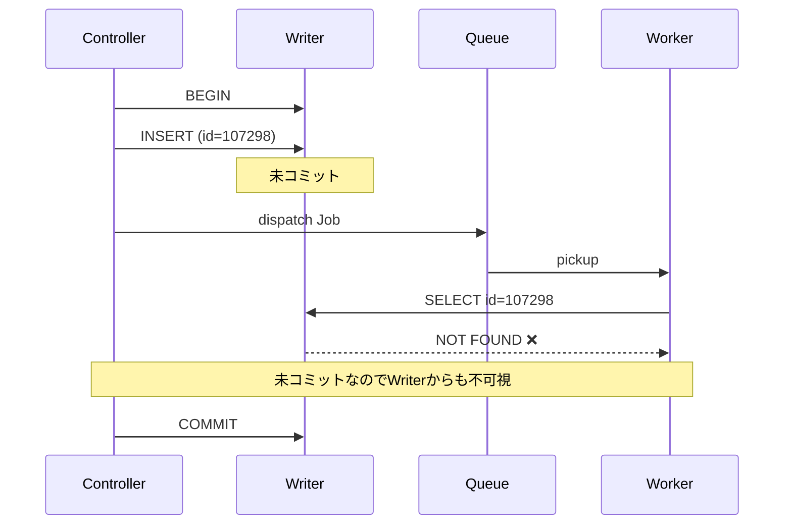
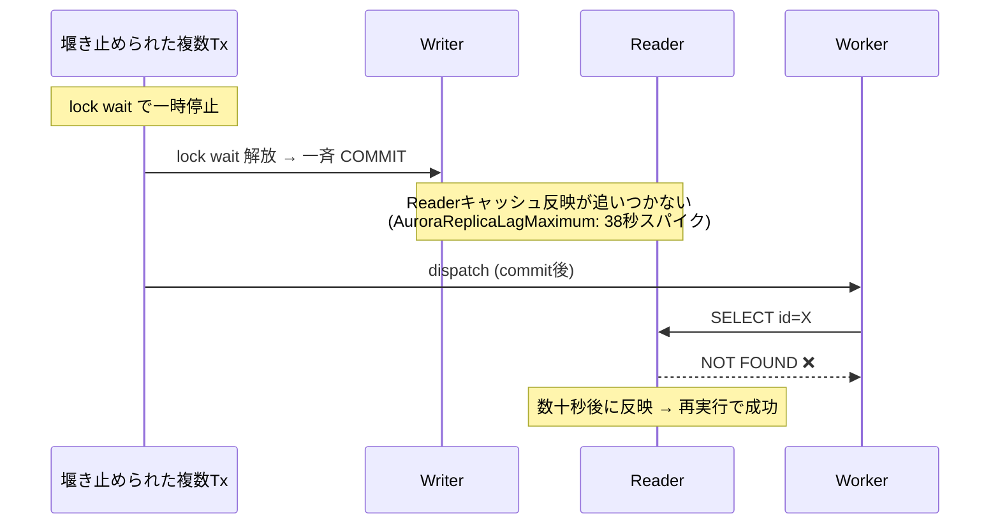

# DB障害を追う——NOT FOUNDの犯人は、2人いた

## 「登録したはずのデータが読めない」

データを保存する処理は成功している。しかし直後に走る後続処理で、そのデータがNOT FOUND（Laravel/Eloquentの `ModelNotFoundException: No query results for model [...]` として観測）。時間が経てばデータは存在する。再実行すれば成功する——。

Writer/Readerレプリカ構成（Amazon Aurora MySQL）のシステムで、このエラーが散発的に報告されていました。同じ時期にlock waitやデッドロックも多発しており（[記事1](./article1.md)・[記事2](./article2.md)で調査）、当初は「lock waitによるレプリケーション遅延」が原因だと考えていました。

---

## 1. レプリケーション遅延を疑った——というより、確信していた

[記事2](./article2.md)で、lock waitが引き起こすレプリカ遅延のメカニズム（ダム決壊モデル）を検証しました。一般的なMySQLのレプリケーション（binlogベース）では、堰き止められたTxが一斉にCOMMITされるとbinlogに大量の変更が流入し、Replicaの適用が追いつかなくなります。

本番はAurora MySQL。共有ストレージ型なので通常のbinlogレプリケーションとは異なりますが、**高負荷時にはReaderのキャッシュ反映が遅延することがあります**。つまり構造は違えど、同様の「堰き止め → 一斉解放 → 反映遅延」が起きえます。仮説はこうです。

1. 問題のTxがlock waitを引き起こす
2. 堰き止められたTxが一斉にCOMMIT → Readerに反映すべき変更が一気に積み上がる
3. 高負荷でReaderのキャッシュ反映が追いつかず、遅延が拡大

この仮説はきれいすぎるほどきれいでした。lock waitとNOT FOUNDが同じ時間帯に起きている。Writer/Reader構成でReaderから読んでいる。原因はレプリケーション遅延——これ以外にあるだろうか？

正直なところ、メトリクスを確認するのは「答え合わせ」のつもりでした。

---

## 2. メトリクスを確認する

CloudWatchでAuroraReplicaLagを開きました。NOT FOUNDエラーが発生していた時間帯を表示して、レプリカ遅延のスパイクを探します。

**AuroraReplicaLag（平均）**: 5〜33ms。グラフはほぼ平坦。

ただし、AuroraReplicaLagMaximumを見ると、瞬間的に38秒のスパイクが記録された日がありました。lock wait解放後に堰き止められたトランザクションが一斉にコミットし、Readerへの反映が追いつかなくなる——[記事2](./article2.md)で検証した「ダム決壊」が、Auroraでもキャッシュ反映遅延として現れた形です。この日のNOT FOUNDは、レプリケーション遅延で説明がつきます。

しかし、**スパイクのない日にも同じNOT FOUNDが発生していました。**

AuroraReplicaLagが5〜33msで安定している時間帯に、同じエラーが散発している。Auroraは共有ストレージ型のアーキテクチャで、WriterとReaderが同じストレージを参照するため、通常時のレプリカ遅延はms単位に収まります。この程度の遅延でNOT FOUNDが起きるとは考えにくい。

**レプリケーション遅延だけでは、全ケースを説明できない。** 別のメカニズムが関与しているはずです。

---

## 3. さらに調査——コードを追う

レプリケーション遅延が起きていない日にもNOT FOUNDが発生している。レプリカ遅延以外に、データが「見つからない」状態を作り出すメカニズムがあるはずです。

Readerが遅れているのではないなら、**そもそもWriterにデータがコミットされていない**タイミングがあるのではないか。後日確認するとデータは存在していたので、いずれコミットはされている。問題は**タイミング**です。

コードを追っていくと、こういう構造が見えました。

```php
// Controller
DB::beginTransaction();

// ① レコードをINSERT（まだ未コミット）
$result = resolve(CreateRequestAction::class)->handle($data);
    // この中で:
    // - レコードをINSERTする
    // - ProcessFollowUpJob をキューにdispatch ← ②

DB::commit(); // ③ ここでようやくコミット
```

ジョブのdispatch（②）がcommit（③）より先。**キューワーカーが②の直後にジョブを拾うと、③のcommitがまだ実行されていないため、Writerにすらデータが存在しない。**

---

## 4. 検証

MySQLのトランザクション内で未コミットのデータが別の接続から見えるか確認しました。

```
接続A: BEGIN → INSERT (id=107298) → コミットしない

接続B: SELECT WHERE id = 107298 → NULL（見えない）

接続A: COMMIT

接続B: SELECT WHERE id = 107298 → 1行（見える）
```

**未コミットのデータは、同じWriterの別接続からも不可視。** これはMySQLのトランザクション分離レベル（デフォルトのREPEATABLE READ）の正常な動作です。レプリケーション遅延とは一切関係ありません。

---

## 5. なぜ散発的に起きるのか

毎回起きるわけではありません。以下の条件が重なったときだけ発生します。

```
① beginTransaction
② INSERT（未コミット）
③ Job dispatch → キューに入る
            ↕ ← この隙間でワーカーがジョブを拾うとNOT FOUND
④ commit
```

③と④の間は通常ほんの数ms。しかし:

- キューワーカーが即座にジョブを拾える状態（アイドル中）だと、commitより先に実行される
- Controllerの処理が重い（他のDB操作やAPI呼び出しが③〜④の間にある）と、隙間が広がる
- lock waitやデッドロックが発生して③〜④の間に時間がかかると、さらに発生確率が上がる

lock waitの存在がレースコンディションの発生確率を高めていた。これが「lock waitとNOT FOUNDが同じ時間帯に起きていた」理由の一つです。

---

## 6. 2つのメカニズム

ここまでの調査で、NOT FOUNDには2つの発生メカニズムがあることがわかりました。

**メカニズムA: レースコンディション（commit前dispatch）**



ジョブがcommit前にdispatchされ、ワーカーが先にデータを読みに行く。**Writerにすらデータが存在しない**ため、どこから読んでもNOT FOUND。レプリケーション遅延とは無関係に、単体で発生する。

**メカニズムB: ダム決壊（レプリケーション遅延）**



WriterにはデータがあるがReaderにまだ反映されていない。AuroraReplicaLagMaximumに38秒のスパイクとして記録される。

**両方が重なる日:**

lock waitが発生すると、Aのcommitまでの隙間が広がり（レースコンディションの発生確率UP）、同時にBのダム決壊も起きる。NOT FOUNDの件数と持続時間が増大する。

| | スパイクなしの日 | スパイクありの日 |
|---|:---:|:---:|
| メカニズムA（レースコンディション） | 発生する | 発生する（確率UP） |
| メカニズムB（レプリカ遅延） | 発生しない | 発生する |

スパイクのない日に起きるNOT FOUNDはAだけ。スパイクのある日はA＋B。レプリケーション遅延だけを見ていては、Aを見落とします。

---

## 7. 修正方法

Laravelでは`afterCommit`を指定すると、トランザクションのコミット後にジョブがdispatchされます。

```php
// 修正前
$jobs[] = (new ProcessFollowUpJob($jobId));

// 修正後
$jobs[] = (new ProcessFollowUpJob($jobId))->afterCommit();
```

または、ジョブクラスに`$afterCommit`プロパティを設定:

```php
class ProcessFollowUpJob extends BaseJob
{
    public $afterCommit = true;  // ← 追加
    // ...
}
```

これにより、dispatchのタイミングが以下のように変わります。

```
修正前: BEGIN → INSERT → dispatch → commit
修正後: BEGIN → INSERT → commit → dispatch
```

コミットが確定してからジョブが投入されるため、ワーカーは必ずコミット済のデータを読めます。これでメカニズムAは解消されます。

メカニズムBについては、lock waitの根本原因を解消する（[記事1](./article1.md)）ことでダム決壊自体を防ぎます。

---

## 振り返り

| 段階 | やったこと | わかったこと |
|------|-----------|------------|
| 仮説構築 | lock wait → レプリケーション遅延 → NOT FOUND | もっともらしいストーリー |
| メトリクス確認 | AuroraReplicaLagを確認 | スパイクのある日とない日がある |
| 疑問 | スパイクのない日にもNOT FOUNDが発生 | レプリケーション遅延だけでは説明できない |
| コード調査 | dispatch/commitの順序を確認 | **commitの前にdispatchしていた** |
| 検証 | 未コミットデータの可視性テスト | 別接続からは不可視 |
| 整理 | 2つのメカニズムを比較 | **レースコンディション＋ダム決壊の複合障害** |

> **NOT FOUNDの犯人は2人いた。常に潜んでいたレースコンディションと、lock wait時にだけ現れるレプリケーション遅延。レプリケーション遅延だけを追っていたら、もう1人を見逃すところだった。**

---

### 教訓

1. **トランザクション内でジョブをdispatchするな。** commitの後にdispatchするか、`afterCommit`を使う
2. **単一原因に飛びつくな。** 同じ症状に複数のメカニズムが関与していることがある。「全ケースを説明できるか」を常に問う
3. **メトリクスは仮説の検証だけでなく、仮説の拡張にも使え。** スパイクのある日とない日の差異が、2つ目のメカニズムの存在を示していた

---

## 再現環境

commit前dispatchによるレースコンディションの検証コードを公開しています。

```bash
git clone https://github.com/TaichiFujii0326/deadlock-replication-demo.git
cd deadlock-replication-demo
make race-demo
```

```
commit前にdispatch: 10回中 10回 NOT FOUND（100%）
commit後にdispatch: 10回中  0回 NOT FOUND（0%）
```

---

**タグ**: AWS, Amazon Aurora, Aurora MySQL, Laravel, Eloquent, Race Condition, afterCommit, ModelNotFoundException, No query results for model, AuroraReplicaLag, AuroraReplicaLagMaximum, Replication Lag, Queue, Job dispatch
