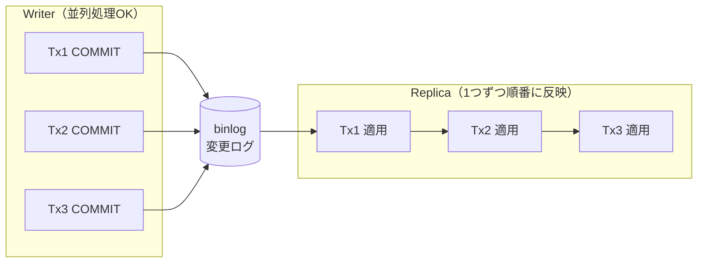
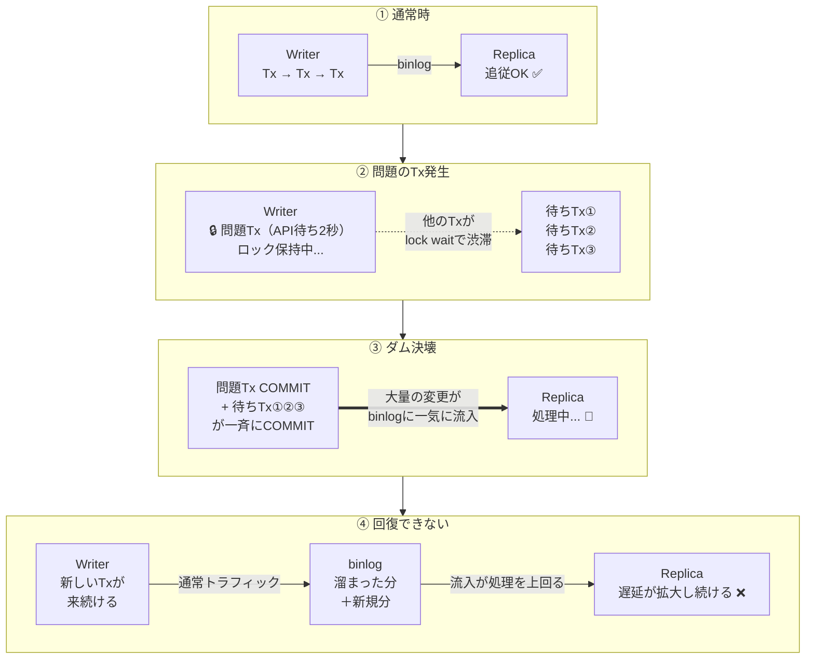

# 【図解】INSERT → 外部API → 論理削除：デッドロック調査から辿り着いた「本当の犯人」

## 障害発生

ある日、Writer/Readレプリカ構成（書き込み用データベースと読み取り用データベースを分ける構成）で運用中のシステムで、こんな報告が上がってきました。

**「登録したはずのデータが『存在しない』というエラーになる」**

ユーザーがデータを登録した直後の処理で、そのデータが見つからない。しかもこの状態が**数十分〜数時間**続いていました。

調べ始めると、裏側ではlock wait（ロックの順番待ち）やデッドロック（ロックの循環待機で処理が強制終了される現象）が発生していたことがわかりました。

※ 以下、トランザクションを「Tx」と略します。

デッドロックの原因（Tx内での外部API呼び出し）は特定できたので修正しました。

しかし、疑問が残りました。

**更新対象はたかだか数十件。デッドロックも一瞬で解消されたはず。なのになぜ、数十分〜数時間もデータが読めない状態が続いたのか？**

この疑問を追っていった結果、デッドロックの奥にある「本当の犯人」に辿り着きました。

---

## 1. まずデッドロックを直した

lock waitとデッドロックの原因を調べると、該当の処理はこういうコードでした。

```sql
BEGIN;
  INSERT INTO configs (...) VALUES (...);   -- ① 新しい設定を登録
  外部API呼び出し（決済・通知など）             -- ② 数百ms〜数秒待機
  UPDATE configs SET is_deleted = 1          -- ③ 自分以外を論理削除
    WHERE tenant_id = ? AND id != ? AND is_deleted = 0;
COMMIT;
```

「最新の設定だけ残して、古いのを論理削除する」というよくある処理。これが並行で走るとデッドロックが起きます。

### デッドロックの発生シーケンス

| 時刻 | Tx A | Tx B |
|:-----|:-----|:-----|
| **t0** | **INSERT** (id=201) → 排他ロック取得（「この行は自分が使用中」という宣言） | |
| **t1** | | **INSERT** (id=202) → 排他ロック取得 |
| **t2** | 外部API待ち中...(2秒) | 外部API待ち中...(2秒) |
| | *id=201のロック保持したまま* | *id=202のロック保持したまま* |
| **t3** | **UPDATE** → id=202が欲しい（B保持中） | **UPDATE** → id=201が欲しい（A保持中） |

お互いが相手のロックを待ち続ける循環待機が発生。MySQLはこれをデッドロックとして検知し、片方のTxを強制ロールバックして解消します。

### なぜ循環が生まれるのか

InnoDBは `UPDATE WHERE id != ?` のような範囲条件に対して、**条件に合う行だけでなく広い範囲にロックをかけに行きます**。だから相手がINSERTした行も巻き込んで循環待機が起きます。

### 外部APIが「デッドロック増幅装置」になる

本来、データベースの更新は数ミリ秒で終わるため、ロック競合の隙はほぼありません。しかし、間に外部APIが挟まることでロック保持時間が数百倍に伸びます。

**「ちょっと鍵貸して」の状態が、API待ちのせいで「1時間立てこもり」に変わるようなもの。** 当然、衝突確率は跳ね上がります。

---

## 2. デッドロックを直しても疑問が残る

デッドロックの原因はわかったので修正しました。しかし腑に落ちない。

**数十件の更新で、なぜ数十分〜数時間もReplicaでデータが読めなかったのか？**

デッドロックを直すだけでは説明がつかない。再現環境を作って検証することにしました。

---

## 3. レプリケーションの仕組み

検証の前に、Writer/Readレプリカ構成でデータがどう同期されるか、基本を押さえておきます。



※ **binlog（バイナリログ）** = Writerで「どの行をどう変更したか」を時系列で記録するログファイル。Replicaはこれを受信して自分のデータベースに反映します。

ここに構造的なボトルネックがあります。Writerは並列で高速に処理できるのに、Replicaは受信した変更を**1つずつ順番に**反映するしかない。この**並列度のギャップ**が後で効いてきます。

---

## 4. 検証① — 問題のTxだけを実行する

Docker Compose環境（MySQL 8.4、非同期レプリケーション）で、本番と同じ処理を2つ同時実行しました。初期データ50,000行、外部APIは `time.Sleep(2秒)` で模擬。

```
T+0ms      2つのTxを同時実行（50,000行のactiveデータあり）
T+2645ms   デッドロック発生 → Tx1がロールバック、Tx2がコミット（50,000行削除）
T+2745ms   Replicaで読めない
  ...       (100ms間隔でポーリング)
T+3246ms   ようやく読めた    読めなかった時間: 501ms
```

デッドロック1回で**500ms、Replicaでデータが読めない状態**（以下「Stale Read」と呼びます）が発生。

しかし本番では数十分〜数時間。**まだ何かが足りない。**

---

## 5. 検証② — 通常トラフィックを流しながら実行する

前の検証では問題のTxだけを実行して終わりでした。しかし本番では、**問題のTxが走っている最中も、通常リクエストやバッチ登録処理がWriterに書き込み続けている**。実際に現象が深刻化したのは、登録バッチジョブと問題のTxが重なったタイミングでした。

ただし本質は「Replicaの処理速度を超える流入が続く限り回復しない」ことにあり、バッチがなくても条件次第で同じ現象は起きえます。

そこで条件を変えました。

- **初期データ**: 100行（本番に近い規模。検証①の50,000行は最悪ケースの確認用）
- **バックグラウンド**: 5 workerが通常の書き込みを継続
- **途中で注入**: 問題のTx（INSERT → API 2秒 → DELETE）を3回実行

> **注記**: Docker環境ではReplicaに余裕があるため、再現にはバックグラウンド負荷を高めに設定しています。本番ではネットワーク遅延やディスクI/Oの制約があるため、より少ない負荷で同じ現象が発生します。

### 結果

```
[ウォームアップ]  通常トラフィックだけ → lag = 17ms（余裕で追従）

[問題のTx注入 × 3回]
  1回目: デッドロック発生、100行削除  → lag = 6,693ms
  2回目: デッドロック発生、1行削除    → lag = 8,929ms
  3回目: デッドロック発生、1行削除    → lag = 11,280ms

[注入終了後 — 通常トラフィックだけの状態]
  +0秒:  lag = 13,627ms
  +10秒: lag = 18,518ms    ← 縮まるどころか拡大
  +20秒: lag = 24,394ms
  +30秒: lag = 31,019ms
  +40秒: lag = 38,702ms
  +60秒: lag = 54,381ms    ← まだ拡大中。回復の兆しなし
```

**問題のTxを3回実行しただけで、Replicaの遅延が54秒に達し、60秒経っても回復しませんでした。**

---

## 6. なぜ問題のTxが終わっても回復しないのか

検証①では500msで回復しました。しかし検証②では60秒経っても拡大し続ける。違いは**通常トラフィックの有無**だけです。実際に起きているのは**複合的な負荷の連鎖**です。

### **ダム決壊モデル**



ダム決壊は一瞬の出来事ですが、その後に起きるのは**交通渋滞と同じ構造**です。

> 高速道路で事故が起きて30分間1車線に規制された。事故は処理されたが、溜まった車列は数キロ。規制解除後も通常の車が後ろから来続ける。車列の消化には事故処理よりはるかに長い時間がかかる。

**ダム決壊がbinlogの洪水を生み、交通渋滞がその回復を阻む。** 一度流入速度が処理速度を上回ると、トラフィックが減る時間帯（夜間など）まで遅延は解消されません。これが本番で数時間のStale Readが続いた理由です。

※ マルチスレッドレプリケーション（MySQL 8.0+）で並列適用すれば？と思うかもしれませんが、今回の問題Txは広範囲にロックをかけるため通常Txと競合しやすく、Replica側でも結局直列になります。**Writer側の設計を直さない限り、ダム決壊は防げません**。

---

## 7. 改善策の実測比較 — パターンCの罠

改善策を4パターン実装し、検証①②と同じ条件（50,000行、API 2秒、2Tx同時実行）で実測しました。

そもそも外部APIはDB操作の**100〜10,000倍遅い**。この2つを同じTxに入れると、ロック保持時間がAPIのペースに引きずられます。本当に重要なのは**ロック保持時間**です。

| 処理 | 所要時間 |
|------|---------|
| 1行のINSERT | 0.1〜1ms |
| 100行のUPDATE | 1〜10ms |
| 外部API呼び出し | **100〜3,000ms** |

| パターン | デッドロック | ロック保持時間 | Stale Read |
|----------|:---:|:---:|:---:|
| **Before**: Tx内でAPI実行 | 1回 | **約2.6秒**（API待ち中ずっと） | **4回** |
| **A: API外出し** | **0** | **数ms × 2回** | **0** |
| **B: API先出し** | 1回 | **数十〜数百ms** | **4回** |
| **C: 先にロック確保** | **0** | **約3.6秒**（API待ち＋lock wait） | **0** |

各パターンの処理フロー:

- **Before**: `BEGIN → INSERT → API(2秒) → DELETE → COMMIT`
- **A**: `BEGIN → INSERT → COMMIT` → API(2秒) → `BEGIN → DELETE → COMMIT`
- **B**: API(2秒) → `BEGIN → INSERT → DELETE → COMMIT`
- **C**: `BEGIN → SELECT FOR UPDATE → INSERT → API(2秒) → DELETE → COMMIT`

※ パターンBでもデッドロックが起きるのは、INSERT→DELETEの間のロック競合が残るため。APIを先に済ませてもTx内のロック順序が変わらなければデッドロックは消えません。

掛け合わせ（B+C、A+C）も検証しましたが、**パターンA単体ですべて解決**しており、掛け合わせの追加効果はありませんでした。

### パターンCの罠

パターンCはデッドロックが消えます。しかし**ロック保持時間が約3.6秒で全パターン中最長**（Beforeの約2.6秒よりさらに悪化）。

SELECT FOR UPDATE（更新対象の行を先に明示的にロックする手法）でロック順序を固定したので循環待機は消えました。しかし**API待ちの間ロックを保持し続ける構造は変わらない**。2つ目のTxは、1つ目がAPI 2秒 + DELETE完了まで丸ごとlock waitで待たされていたため、Before以上にロックが長引いています。

**「デッドロックを直す ≠ 問題を直す」。** アラートは消えますが、lock waitの行列は残り、ダム決壊は起き続けます。

---

## 8. 改善後のコード

パターンA（API外出し）の実装：

```go
// Tx1: INSERT だけ COMMIT（ロック保持: 数ms）
tx1, _ := db.BeginTx(ctx, nil)
result, _ := tx1.ExecContext(ctx,
    "INSERT INTO configs (tenant_id, config_value, status) VALUES (?, ?, 'pending')",
    tenantID, value)
newID, _ := result.LastInsertId()
tx1.Commit()  // ← ここでロックを解放

// API呼び出し（データベースのロックは持っていない）
resp, err := callExternalAPI()

// Tx2: 結果を反映（ロック保持: 数ms）
tx2, _ := db.BeginTx(ctx, nil)
if err != nil {
    tx2.ExecContext(ctx, "UPDATE configs SET status = 'failed' WHERE id = ?", newID)
} else {
    tx2.ExecContext(ctx,
        "UPDATE configs SET status = 'completed', external_id = ? WHERE id = ?",
        resp.ID, newID)
    tx2.ExecContext(ctx,
        `UPDATE configs SET is_deleted = 1, deleted_at = NOW(6)
         WHERE tenant_id = ? AND id != ? AND is_deleted = 0`,
        tenantID, newID)
}
tx2.Commit()
```

**注意点**: API中にクラッシュすると `pending` のまま残ります。定期ジョブで回収する仕組みが必要です。

Txを分割すると「一発で全部完了」の前提が崩れるため、ビジネス側の要件（許容できる中間状態、失敗時のリカバリ方針など）と擦り合わせた改修が必要だと思われます。

---

## 振り返り

| 調査の段階 | わかったこと |
|-----------|-------------|
| デッドロック調査 | INSERT → API → DELETE の順序でロック競合 |
| 検証①（問題Txのみ） | デッドロック1回、50,000行削除で500msのStale Read |
| 検証②（通常トラフィック） | **問題Tx×3回で遅延54秒、回復しない** |
| 改善パターンC | **デッドロックを消してもlock waitが残れば問題は解決しない** |

> **本当の犯人はデッドロックではなく、lock waitによる更新の渋滞。**
> lock waitが引き起こす「ダム決壊」と「通常トラフィックの継続流入」が重なることで、たった数十件の更新が数十分〜数時間のレプリカ遅延に化ける。

あなたのコードにも、ロックを握りしめたまま外の世界の応答を待っている処理はありませんか？

---

### 3行まとめ

1. トランザクション内の外部APIは、ロック保持時間を数千倍にし「lock wait」を爆増させる
2. デッドロック回避（SELECT FOR UPDATE等）だけでは、堰き止められた更新による「レプリカ遅延の爆発」は防げない
3. 解決策は「APIをTxの外に出す」一択。データベースと外の世界を同じTxに入れてはいけない

---

## 再現環境

この記事の検証コードはリポジトリで公開しています。`make demo` 一発で再現できます。

```bash
git clone https://github.com/TaichiFujii0326/deadlock-replication-demo.git
cd deadlock-replication-demo
make demo
```
